# [📈 Live Status](https://GamerIndiaOfficial.github.io/upptime): <!--live status--> **🟧 Partial outage**

This repository contains the open-source uptime monitor and status page for [GamerIndia](https://GamerIndiaOfficial.github.io/upptime), powered by [Upptime](https://github.com/upptime/upptime).

With [Upptime](https://upptime.js.org), you can get your own unlimited and free uptime monitor and status page, powered entirely by a GitHub repository. We use [Issues](https://github.com/GamerIndiaOfficial/upptime/issues) as incident reports, [Actions](https://github.com/GamerIndiaOfficial/upptime/actions) as uptime monitors, and [Pages](https://GamerIndiaOfficial.github.io/upptime) for the status page.

<!--start: status pages-->
<!-- This summary is generated by Upptime (https://github.com/upptime/upptime) -->
<!-- Do not edit this manually, your changes will be overwritten -->
<!-- prettier-ignore -->
| URL | Status | History | Response Time | Uptime |
| --- | ------ | ------- | ------------- | ------ |
|  [Projects-of-Dream](https://gamerindiaofficial.github.io/Projects-of-dream) | 🟩 Up | [projects-of-dream.yml](https://github.com/GamerIndiaOfficial/upptime/commits/HEAD/history/projects-of-dream.yml) | 

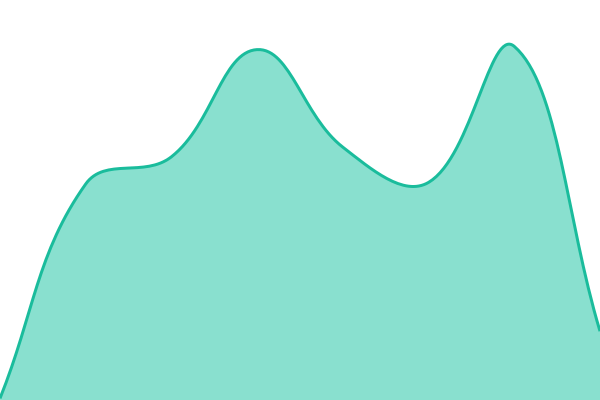 139ms
     
 | 

<a href="https://GamerIndiaOfficial.github.io/upptime/history/projects-of-dream">100.00%</a>
    

|  [Internet Archive](https://archive.org) | 🟩 Up | [internet-archive.yml](https://github.com/GamerIndiaOfficial/upptime/commits/HEAD/history/internet-archive.yml) | 

 325ms
     
 | 

<a href="https://GamerIndiaOfficial.github.io/upptime/history/internet-archive">100.00%</a>
    

|  [Open Library](https://openlibrary.org) | 🟩 Up | [open-library.yml](https://github.com/GamerIndiaOfficial/upptime/commits/HEAD/history/open-library.yml) | 

 1093ms
     
 | 

<a href="https://GamerIndiaOfficial.github.io/upptime/history/open-library">100.00%</a>
    

|  [Mozilla](https://mozilla.org) | 🟩 Up | [mozilla.yml](https://github.com/GamerIndiaOfficial/upptime/commits/HEAD/history/mozilla.yml) | 

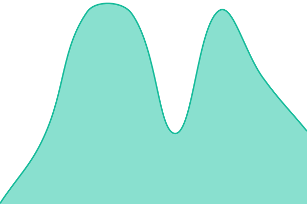 402ms
     
 | 

<a href="https://GamerIndiaOfficial.github.io/upptime/history/mozilla">100.00%</a>
    

|  [Wikipedia](https://wikipedia.org) | 🟩 Up | [wikipedia.yml](https://github.com/GamerIndiaOfficial/upptime/commits/HEAD/history/wikipedia.yml) | 

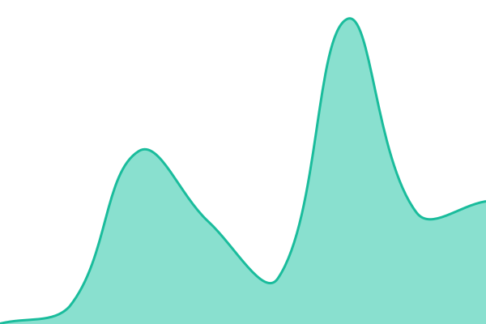 315ms
     
 | 

<a href="https://GamerIndiaOfficial.github.io/upptime/history/wikipedia">100.00%</a>
    

|  [Proton](https://proton.me) | 🟩 Up | [proton.yml](https://github.com/GamerIndiaOfficial/upptime/commits/HEAD/history/proton.yml) | 

 1208ms
     
 | 

<a href="https://GamerIndiaOfficial.github.io/upptime/history/proton">100.00%</a>
    

|  [Khan Academy](https://khanacademy.org) | 🟩 Up | [khan-academy.yml](https://github.com/GamerIndiaOfficial/upptime/commits/HEAD/history/khan-academy.yml) | 

 436ms
     
 | 

<a href="https://GamerIndiaOfficial.github.io/upptime/history/khan-academy">100.00%</a>
    

|  [TED](https://ted.com) | 🟩 Up | [ted.yml](https://github.com/GamerIndiaOfficial/upptime/commits/HEAD/history/ted.yml) | 

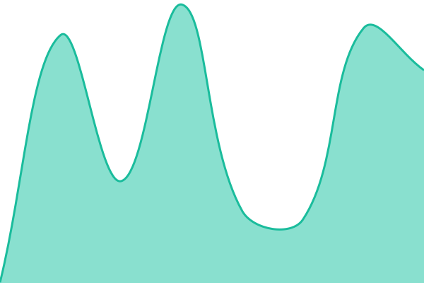 312ms
     
 | 

<a href="https://GamerIndiaOfficial.github.io/upptime/history/ted">100.00%</a>
    

|  [Wikimedia Commons](https://commons.wikimedia.org) | 🟩 Up | [wikimedia-commons.yml](https://github.com/GamerIndiaOfficial/upptime/commits/HEAD/history/wikimedia-commons.yml) | 

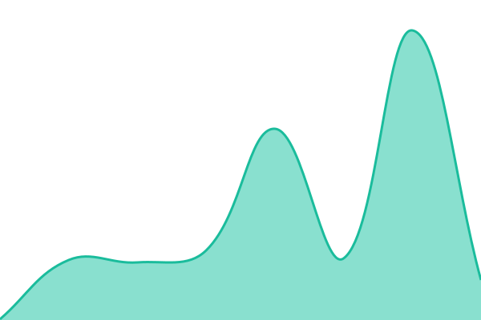 228ms
     
 | 

<a href="https://GamerIndiaOfficial.github.io/upptime/history/wikimedia-commons">100.00%</a>
    

|  [NPR](https://npr.org) | 🟩 Up | [npr.yml](https://github.com/GamerIndiaOfficial/upptime/commits/HEAD/history/npr.yml) | 

 523ms
     
 | 

<a href="https://GamerIndiaOfficial.github.io/upptime/history/npr">100.00%</a>
    

|  [National Geographic Society](https://nationalgeographic.org) | 🟩 Up | [national-geographic-society.yml](https://github.com/GamerIndiaOfficial/upptime/commits/HEAD/history/national-geographic-society.yml) | 

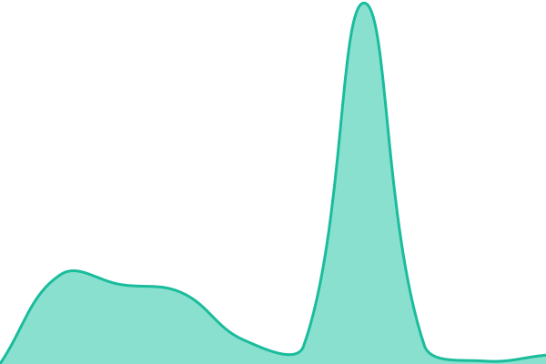 770ms
     
 | 

<a href="https://GamerIndiaOfficial.github.io/upptime/history/national-geographic-society">100.00%</a>
    

|  [Creative Commons](https://creativecommons.org) | 🟩 Up | [creative-commons.yml](https://github.com/GamerIndiaOfficial/upptime/commits/HEAD/history/creative-commons.yml) | 

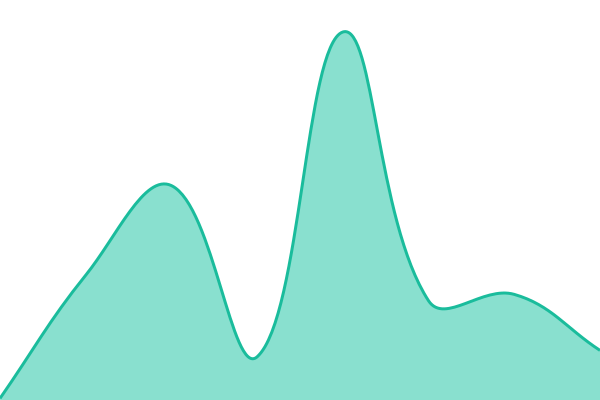 222ms
     
 | 

<a href="https://GamerIndiaOfficial.github.io/upptime/history/creative-commons">100.00%</a>
    

|  [OpenStreetMap](https://openstreetmap.org) | 🟩 Up | [open-street-map.yml](https://github.com/GamerIndiaOfficial/upptime/commits/HEAD/history/open-street-map.yml) | 

 809ms
     
 | 

<a href="https://GamerIndiaOfficial.github.io/upptime/history/open-street-map">100.00%</a>
    

|  [World Health Organization](https://who.int) | 🟩 Up | [world-health-organization.yml](https://github.com/GamerIndiaOfficial/upptime/commits/HEAD/history/world-health-organization.yml) | 

 764ms
     
 | 

<a href="https://GamerIndiaOfficial.github.io/upptime/history/world-health-organization">100.00%</a>
    

|  [Médecins Sans Frontières (Doctors Without Borders)](https://msf.org) | 🟩 Up | [medecins-sans-frontieres-doctors-without-borders.yml](https://github.com/GamerIndiaOfficial/upptime/commits/HEAD/history/medecins-sans-frontieres-doctors-without-borders.yml) | 

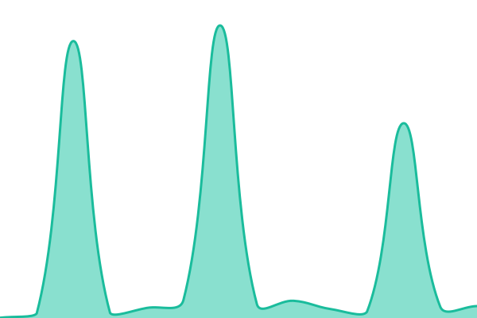 1500ms
     
 | 

<a href="https://GamerIndiaOfficial.github.io/upptime/history/medecins-sans-frontieres-doctors-without-borders">100.00%</a>
    

|  [Amnesty International](https://amnesty.org) | 🟩 Up | [amnesty-international.yml](https://github.com/GamerIndiaOfficial/upptime/commits/HEAD/history/amnesty-international.yml) | 

 951ms
     
 | 

<a href="https://GamerIndiaOfficial.github.io/upptime/history/amnesty-international">100.00%</a>
    

|  [Greenpeace](https://greenpeace.org) | 🟩 Up | [greenpeace.yml](https://github.com/GamerIndiaOfficial/upptime/commits/HEAD/history/greenpeace.yml) | 

 815ms
     
 | 

<a href="https://GamerIndiaOfficial.github.io/upptime/history/greenpeace">100.00%</a>
    

|  [Wikimedia Foundation](https://wikimediafoundation.org) | 🟩 Up | [wikimedia-foundation.yml](https://github.com/GamerIndiaOfficial/upptime/commits/HEAD/history/wikimedia-foundation.yml) | 

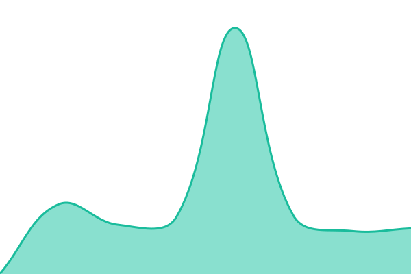 1059ms
     
 | 

<a href="https://GamerIndiaOfficial.github.io/upptime/history/wikimedia-foundation">100.00%</a>
    

|  [Open Knowledge Foundation](https://okfn.org) | 🟩 Up | [open-knowledge-foundation.yml](https://github.com/GamerIndiaOfficial/upptime/commits/HEAD/history/open-knowledge-foundation.yml) | 

 725ms
     
 | 

<a href="https://GamerIndiaOfficial.github.io/upptime/history/open-knowledge-foundation">100.00%</a>
    

|  [Internet Society](https://internetsociety.org) | 🟩 Up | [internet-society.yml](https://github.com/GamerIndiaOfficial/upptime/commits/HEAD/history/internet-society.yml) | 

 691ms
     
 | 

<a href="https://GamerIndiaOfficial.github.io/upptime/history/internet-society">100.00%</a>
    

|  [EFF (Electronic Frontier Foundation)](https://eff.org) | 🟩 Up | [eff-electronic-frontier-foundation.yml](https://github.com/GamerIndiaOfficial/upptime/commits/HEAD/history/eff-electronic-frontier-foundation.yml) | 

 1014ms
     
 | 

<a href="https://GamerIndiaOfficial.github.io/upptime/history/eff-electronic-frontier-foundation">100.00%</a>
    

|  [FSF (Free Software Foundation)](https://fsf.org) | 🟩 Up | [fsf-free-software-foundation.yml](https://github.com/GamerIndiaOfficial/upptime/commits/HEAD/history/fsf-free-software-foundation.yml) | 

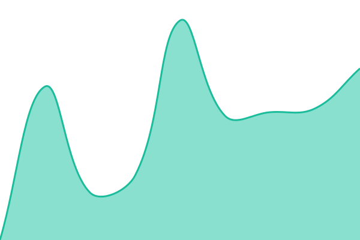 933ms
     
 | 

<a href="https://GamerIndiaOfficial.github.io/upptime/history/fsf-free-software-foundation">100.00%</a>
    

|  [Tor Project](https://torproject.org) | 🟩 Up | [tor-project.yml](https://github.com/GamerIndiaOfficial/upptime/commits/HEAD/history/tor-project.yml) | 

 1145ms
     
 | 

<a href="https://GamerIndiaOfficial.github.io/upptime/history/tor-project">100.00%</a>
    

|  [Python Software Foundation](https://python.org) | 🟩 Up | [python-software-foundation.yml](https://github.com/GamerIndiaOfficial/upptime/commits/HEAD/history/python-software-foundation.yml) | 

 149ms
     
 | 

<a href="https://GamerIndiaOfficial.github.io/upptime/history/python-software-foundation">100.00%</a>
    

|  [Apache Software Foundation](https://apache.org) | 🟩 Up | [apache-software-foundation.yml](https://github.com/GamerIndiaOfficial/upptime/commits/HEAD/history/apache-software-foundation.yml) | 

 71ms
     
 | 

<a href="https://GamerIndiaOfficial.github.io/upptime/history/apache-software-foundation">100.00%</a>
    

|  [Linux Foundation](https://linuxfoundation.org) | 🟩 Up | [linux-foundation.yml](https://github.com/GamerIndiaOfficial/upptime/commits/HEAD/history/linux-foundation.yml) | 

 540ms
     
 | 

<a href="https://GamerIndiaOfficial.github.io/upptime/history/linux-foundation">100.00%</a>
    

|  [Blender Foundation](https://blender.org) | 🟩 Up | [blender-foundation.yml](https://github.com/GamerIndiaOfficial/upptime/commits/HEAD/history/blender-foundation.yml) | 

 1140ms
     
 | 

<a href="https://GamerIndiaOfficial.github.io/upptime/history/blender-foundation">100.00%</a>
    

|  [Code.org](https://code.org) | 🟩 Up | [code-org.yml](https://github.com/GamerIndiaOfficial/upptime/commits/HEAD/history/code-org.yml) | 

 196ms
     
 | 

<a href="https://GamerIndiaOfficial.github.io/upptime/history/code-org">100.00%</a>
    

|  [Project Gutenberg](https://gutenberg.org) | 🟩 Up | [project-gutenberg.yml](https://github.com/GamerIndiaOfficial/upptime/commits/HEAD/history/project-gutenberg.yml) | 

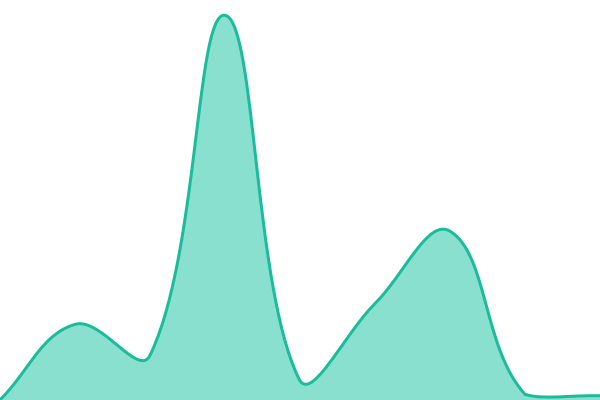 341ms
     
 | 

<a href="https://GamerIndiaOfficial.github.io/upptime/history/project-gutenberg">100.00%</a>
    

|  [Open Culture](https://openculture.com) | 🟩 Up | [open-culture.yml](https://github.com/GamerIndiaOfficial/upptime/commits/HEAD/history/open-culture.yml) | 

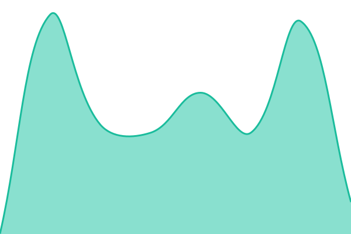 335ms
     
 | 

<a href="https://GamerIndiaOfficial.github.io/upptime/history/open-culture">100.00%</a>
    

|  [ArXiv](https://arxiv.org) | 🟩 Up | [ar-xiv.yml](https://github.com/GamerIndiaOfficial/upptime/commits/HEAD/history/ar-xiv.yml) | 

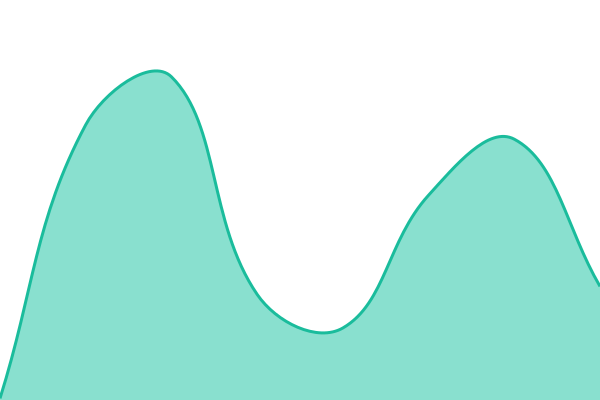 204ms
     
 | 

<a href="https://GamerIndiaOfficial.github.io/upptime/history/ar-xiv">100.00%</a>
    

|  [PLOS (Public Library of Science)](https://plos.org) | 🟩 Up | [plos-public-library-of-science.yml](https://github.com/GamerIndiaOfficial/upptime/commits/HEAD/history/plos-public-library-of-science.yml) | 

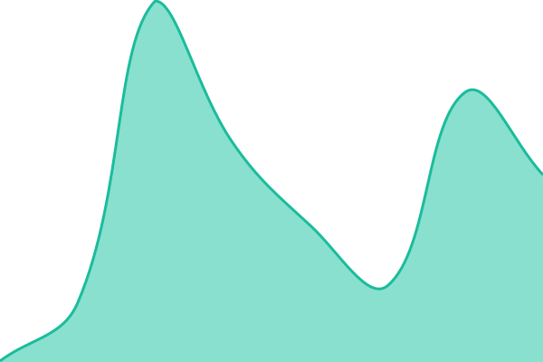 218ms
     
 | 

<a href="https://GamerIndiaOfficial.github.io/upptime/history/plos-public-library-of-science">100.00%</a>
    

|  [DOAJ (Directory of Open Access Journals)](https://doaj.org) | 🟩 Up | [doaj-directory-of-open-access-journals.yml](https://github.com/GamerIndiaOfficial/upptime/commits/HEAD/history/doaj-directory-of-open-access-journals.yml) | 

 465ms
     
 | 

<a href="https://GamerIndiaOfficial.github.io/upptime/history/doaj-directory-of-open-access-journals">100.00%</a>
    

|  [JSTOR (Nonprofit Access)](https://jstor.org) | 🟩 Up | [jstor-nonprofit-access.yml](https://github.com/GamerIndiaOfficial/upptime/commits/HEAD/history/jstor-nonprofit-access.yml) | 

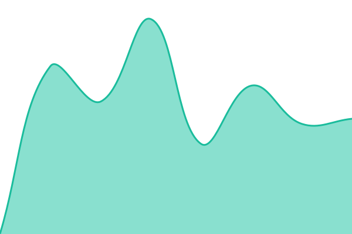 695ms
     
 | 

<a href="https://GamerIndiaOfficial.github.io/upptime/history/jstor-nonprofit-access">100.00%</a>
    

|  [Wikimedia Outreach](https://outreach.wikimedia.org) | 🟩 Up | [wikimedia-outreach.yml](https://github.com/GamerIndiaOfficial/upptime/commits/HEAD/history/wikimedia-outreach.yml) | 

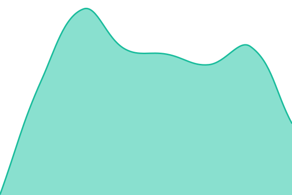 503ms
     
 | 

<a href="https://GamerIndiaOfficial.github.io/upptime/history/wikimedia-outreach">100.00%</a>
    

|  [Wikibooks](https://wikibooks.org) | 🟩 Up | [wikibooks.yml](https://github.com/GamerIndiaOfficial/upptime/commits/HEAD/history/wikibooks.yml) | 

 587ms
     
 | 

<a href="https://GamerIndiaOfficial.github.io/upptime/history/wikibooks">100.00%</a>
    

|  [Wikiversity](https://wikiversity.org) | 🟩 Up | [wikiversity.yml](https://github.com/GamerIndiaOfficial/upptime/commits/HEAD/history/wikiversity.yml) | 

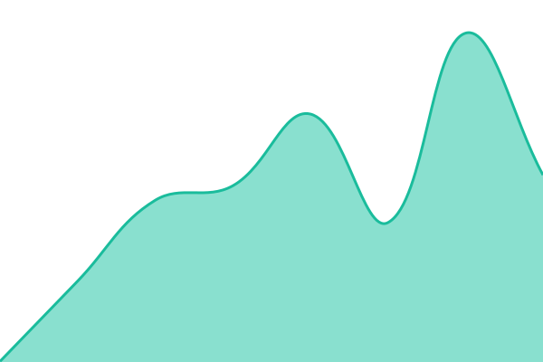 585ms
     
 | 

<a href="https://GamerIndiaOfficial.github.io/upptime/history/wikiversity">100.00%</a>
    

|  [Wikinews](https://wikinews.org) | 🟩 Up | [wikinews.yml](https://github.com/GamerIndiaOfficial/upptime/commits/HEAD/history/wikinews.yml) | 

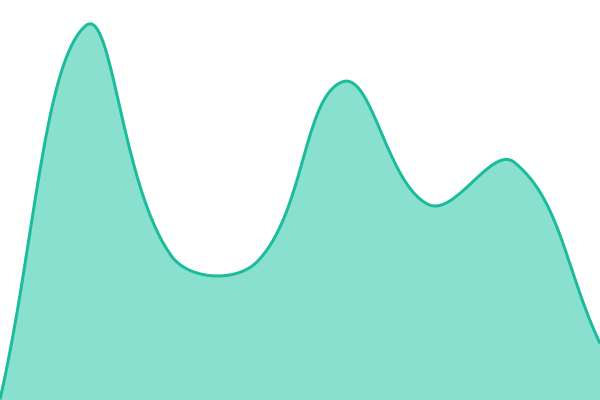 609ms
     
 | 

<a href="https://GamerIndiaOfficial.github.io/upptime/history/wikinews">100.00%</a>
    

|  [Wikiquote](https://wikiquote.org) | 🟩 Up | [wikiquote.yml](https://github.com/GamerIndiaOfficial/upptime/commits/HEAD/history/wikiquote.yml) | 

 590ms
     
 | 

<a href="https://GamerIndiaOfficial.github.io/upptime/history/wikiquote">100.00%</a>
    

|  [Wikispecies](https://species.wikimedia.org) | 🟩 Up | [wikispecies.yml](https://github.com/GamerIndiaOfficial/upptime/commits/HEAD/history/wikispecies.yml) | 

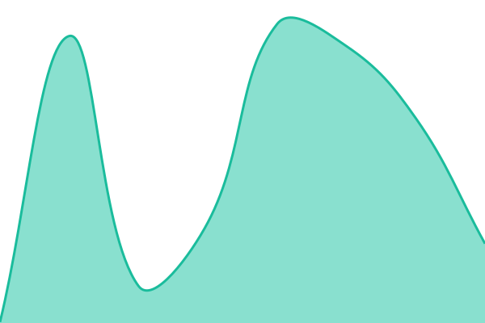 248ms
     
 | 

<a href="https://GamerIndiaOfficial.github.io/upptime/history/wikispecies">100.00%</a>
    

|  [Wikivoyage](https://wikivoyage.org) | 🟩 Up | [wikivoyage.yml](https://github.com/GamerIndiaOfficial/upptime/commits/HEAD/history/wikivoyage.yml) | 

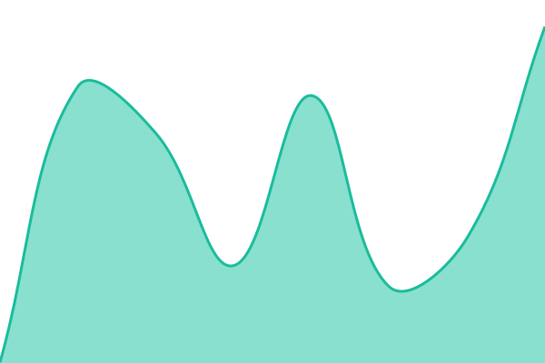 524ms
     
 | 

<a href="https://GamerIndiaOfficial.github.io/upptime/history/wikivoyage">100.00%</a>
    

|  [Charity Navigator](https://charitynavigator.org) | 🟩 Up | [charity-navigator.yml](https://github.com/GamerIndiaOfficial/upptime/commits/HEAD/history/charity-navigator.yml) | 

 398ms
     
 | 

<a href="https://GamerIndiaOfficial.github.io/upptime/history/charity-navigator">100.00%</a>
    

|  [GuideStar](https://guidestar.org) | 🟩 Up | [guide-star.yml](https://github.com/GamerIndiaOfficial/upptime/commits/HEAD/history/guide-star.yml) | 

 515ms
     
 | 

<a href="https://GamerIndiaOfficial.github.io/upptime/history/guide-star">100.00%</a>
    

|  [Open Data Institute](https://theodi.org) | 🟩 Up | [open-data-institute.yml](https://github.com/GamerIndiaOfficial/upptime/commits/HEAD/history/open-data-institute.yml) | 

 1018ms
     
 | 

<a href="https://GamerIndiaOfficial.github.io/upptime/history/open-data-institute">100.00%</a>
    

|  [Internet Governance Forum](https://intgovforum.org) | 🟥 Down | [internet-governance-forum.yml](https://github.com/GamerIndiaOfficial/upptime/commits/HEAD/history/internet-governance-forum.yml) | 

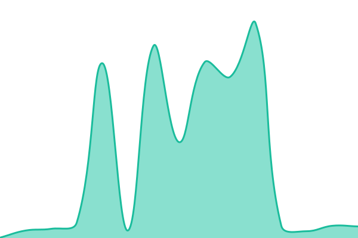 12544ms
     
 | 

<a href="https://GamerIndiaOfficial.github.io/upptime/history/internet-governance-forum">97.93%</a>
    

<!--end: status pages-->

[**Visit our status website →**](https://GamerIndiaOfficial.github.io/upptime)

## 📄 License

- Powered by: [Upptime](https://github.com/upptime/upptime)
- Code: [MIT](./LICENSE) © [Anand Chowdhary](https://anandchowdhary.com), supported by [Pabio](https://pabio.com)
- Data in the `./history` directory: [Open Database License](https://opendatacommons.org/licenses/odbl/1-0/)
